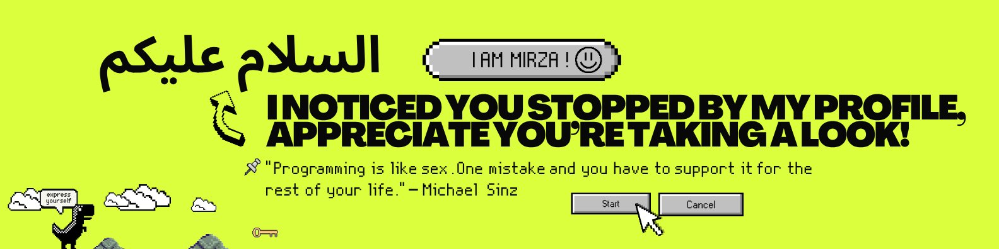

<div align="center">



</div>

<!-- Optional: Circular profile picture on the left like swyx.io (add your profile pic later) -->
<!-- 

-->
---
# Hey Folks!! Curious about me? 

### Take a look below to know What I bring to the table!

```python
class AI_Student:

    def __init__(self):
        self.name                  = "Mirza Manahil Baig"
        self.location              = "Karachi, Pakistan"
        self.role                  = "BS AI Student & Self-Learner"
        self.current_focus         = ["AI", "Machine Learning", "Deep Learning", "Vibe Coding"]
        self.skills                = ["Python", "NumPy", "Pandas", "TensorFlow", "PyTorch", "Git"]
        self.email                 = "mirza.manahil.baig@atomicmail.io"
        self.goal_2026             = "Building a strong AI portfolio"
        self.fun_fact              = "AI enthusiast from Karachi | Love turning math into models"

    def say_hi(self):
        print("Assalam o alaikum! 👋")
        print("I have noticed you've stopped by my profile.")
        print("Thank you for taking a look at my journey.")

me = AI_Student()
me.say_hi()
```

---

# 🛠️ Tech Stack

  

---

# 🚀 Currently Building

[All-You-Need-To-Know-About-Prompt-Engineering](https://github.com/Mirza-dev-arch/All-You-Need-to-Know-About-Prompt-Engineering) — My complete learning journey of Prompt Engineering (notes, visuals, phases & portfolio asset).

---

# 📊 GitHub Stats


---

# 📬 Let's Connect

Email: mirza.manahil.baig@atomicmail.io

---

Feel free to explore my learning journey below 👇
I’m always open to feedback, collaboration, and connecting with fellow AI enthusiasts.

---

---

## 🎮 Play Tic-Tac-Toe Against Me!

You play as **X**, I play as **O**.  
Click any empty cell to make your move.

<div style="max-width: 420px; margin: 20px auto; padding: 20px; background: #0d1117; border-radius: 16px; box-shadow: 0 10px 30px rgba(0,0,0,0.3);">
  <div id="tic-tac-toe" style="display: grid; grid-template-columns: repeat(3, 1fr); gap: 8px; width: 100%; aspect-ratio: 1;">
    <!-- Game board will be generated by JavaScript -->
  </div>
  <div style="text-align: center; margin-top: 15px; font-size: 1.1em; color: #58a6ff;">
    <span id="status">Your turn (X)</span>
  </div>
  <button onclick="resetGame()" style="margin-top: 15px; padding: 10px 20px; background: #238636; color: white; border: none; border-radius: 8px; cursor: pointer;">Reset Game</button>
</div>

<!-- High Score Board -->
<div style="max-width: 420px; margin: 30px auto; padding: 20px; background: #161b22; border-radius: 16px; box-shadow: 0 10px 30px rgba(0,0,0,0.3);">
  <h3 style="text-align: center; color: #58a6ff;">🏆 Top 10 Highest Scoring Visitors</h3>
  <ol id="scoreboard" style="color: #c9d1d9; padding-left: 20px;"></ol>
  <p style="text-align: center; font-size: 0.9em; color: #8b949e; margin-top: 10px;">
    Your current high score: <strong id="your-score">0</strong> wins
  </p>
</div>

<script>
// Simple Tic-Tac-Toe Game + Scoreboard
let board = Array(9).fill(null);
let currentPlayer = 'X';
let gameActive = true;
let wins = 0;

const winningConditions = [
  [0,1,2],[3,4,5],[6,7,8],
  [0,3,6],[1,4,7],[2,5,8],
  [0,4,8],[2,4,6]
];

function createBoard() {
  const container = document.getElementById('tic-tac-toe');
  container.innerHTML = '';
  board.forEach((cell, index) => {
    const cellEl = document.createElement('div');
    cellEl.style.cssText = 'background:#21262d; color:#fff; font-size:2.5em; display:flex; align-items:center; justify-content:center; border-radius:8px; cursor:pointer; aspect-ratio:1;';
    cellEl.textContent = cell || '';
    cellEl.onclick = () => handleClick(index, cellEl);
    container.appendChild(cellEl);
  });
}

function handleClick(index, cellEl) {
  if (!gameActive || board[index]) return;
  
  board[index] = currentPlayer;
  cellEl.textContent = currentPlayer;
  
  if (checkWin(currentPlayer)) {
    wins++;
    document.getElementById('status').innerHTML = `🎉 You win! (${wins} wins)`;
    updateScoreboard();
    gameActive = false;
    return;
  }
  
  if (board.every(cell => cell)) {
    document.getElementById('status').textContent = "It's a draw!";
    gameActive = false;
    return;
  }
  
  currentPlayer = 'O';
  document.getElementById('status').textContent = "My turn (O)";
  
  // Simple AI move (random empty cell)
  setTimeout(() => {
    const empty = board.map((v,i) => v ? null : i).filter(v => v !== null);
    if (empty.length > 0) {
      const move = empty[Math.floor(Math.random() * empty.length)];
      board[move] = 'O';
      document.querySelectorAll('#tic-tac-toe > div')[move].textContent = 'O';
      
      if (checkWin('O')) {
        document.getElementById('status').textContent = "I win! Better luck next time.";
        gameActive = false;
      } else if (board.every(cell => cell)) {
        document.getElementById('status').textContent = "It's a draw!";
        gameActive = false;
      } else {
        currentPlayer = 'X';
        document.getElementById('status').textContent = "Your turn (X)";
      }
    }
  }, 600);
}

function checkWin(player) {
  return winningConditions.some(condition => 
    condition.every(index => board[index] === player)
  );
}

function resetGame() {
  board = Array(9).fill(null);
  currentPlayer = 'X';
  gameActive = true;
  document.getElementById('status').textContent = "Your turn (X)";
  createBoard();
}

function updateScoreboard() {
  // Save to browser localStorage
  let scores = JSON.parse(localStorage.getItem('ticTacToeScores') || '[]');
  scores.push(wins);
  scores.sort((a,b) => b - a);
  scores = scores.slice(0, 10);
  localStorage.setItem('ticTacToeScores', JSON.stringify(scores));
  
  // Display
  const list = document.getElementById('scoreboard');
  list.innerHTML = scores.map((score, i) => 
    `<li><strong>#${i+1}</strong> — ${score} wins</li>`
  ).join('');
  
  document.getElementById('your-score').textContent = wins;
}

// Initialize
createBoard();
updateScoreboard();
</script>


